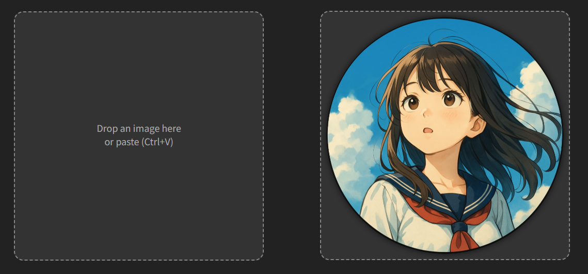

# Cropy

*No setup or dependencies. Just pure, minimal cropping magic.*

## このアプリについて

画像を中央の円形に切り抜く、超シンプルなツールです。  
インストール不要、アップロード不要、余計な機能もなし。  
画像をドラッグ＆ドロップするか、貼り付けるだけで切り抜き結果をすぐに保存できます。

## 機能

- 画像の中心を基準に最大サイズの円形に切り抜きます  
- 外側は透明のPNG形式で保存されます  
- ドラッグ＆ドロップ、またはクリップボードから貼り付け（Ctrl+V）に対応  
- 結果は右クリックから「名前を付けて画像を保存」でダウンロード可能  
- 完全にローカルPC内で動作し、データはどこにも送信されません

## 使い方

1. ブラウザで `index.html` を開きます  
2. 画像をドラッグ＆ドロップするか、クリップボードから貼り付け（Ctrl+V）します  
3. 中央の円形に切り抜かれた画像がすぐに表示されます  
4. 右クリックで「名前を付けて画像を保存」を選んでPNGを保存します

## デモ

## ライセンス

MITライセンスのもとで公開しています。詳しくはLICENSEファイルをご覧ください。

## リリース履歴

### 1.0.0 (2025/07/16)

- ファーストリリース

## 著作権

© 2025 led-mirage. All rights reserved.
